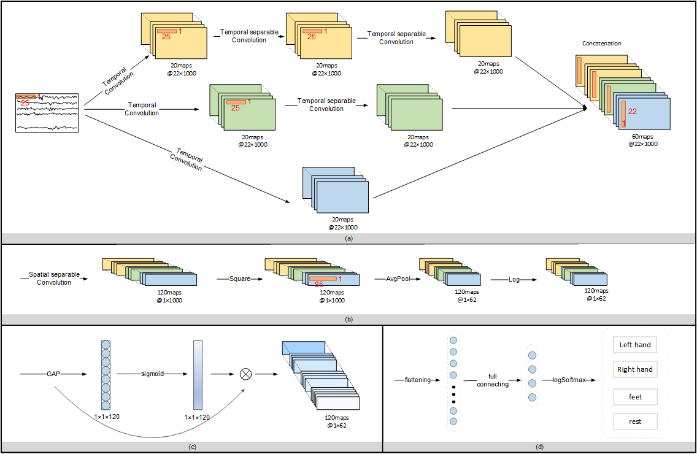

# DMSANet
## DMSANet: A Hybrid Multiscale Attentional Convolutional Neural Network for EEG-based Motor Imagery Decoding
This is the PyTorch implementation of the DMSANet architecture for EEG-MI classification.
### Architecture
To extract discriminative spatio-temporal information of EEG signals, we propose the DMSANet for EEG-based MI decoding. DMSANet is comprised of four modules, i.e., DMS-Conv block, Spatial-Conv block, LAG-Feature-Fussion block, and classification block. The DMS-Conv block captures the temporal information at different scales from raw EEG signals. Then the Spatial-Conv block extracts and compresses spatial features. The LAG-Feature-Fussion block is responsible for fusing and selecting the most relevant features. Finally, the fused features are passed to the classification block for the classification task.

## How to use
The package requirements to run all the codes are provided in file environment.txt. The complete instructions for utilising this toolbox are provided in requirements.txt.

# Acknowledgment
We thank Ravikiran Mane et al. for their useful [toolbox](https://github.com/ravikiran-mane/FBCNet).
We thank  [FBCSP toolbox] https://github.com/kerimalmali/BCI-Dataset-FBCSP/tree/main
